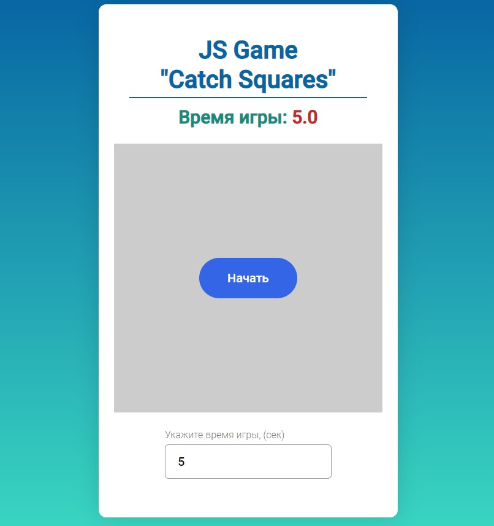

<h1 align="center">JS Game "Catch Squares"</h1>
<h3 align="center">Instruction</h3>

Try to catch  as many squares as you can during the time limit

<h3 align="center"><a href="https://kovalinam.github.io/catchSquares/" target="_blank">Try to play</a></h3>
<h3 align="center">Screenshot</h3>

